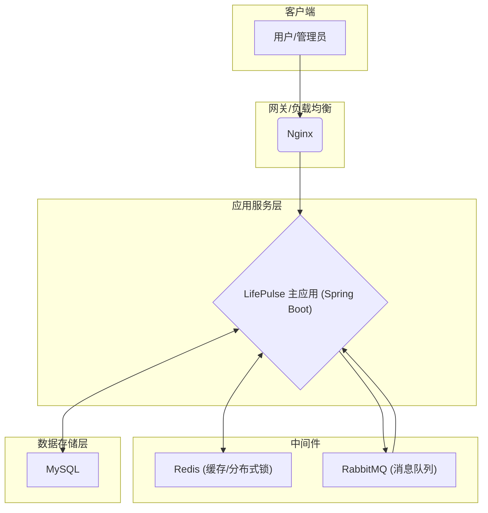

# LifePulse - 高性能本地生活服务平台

## 1. 项目简介
同城生活权益中台，高并发秒杀 + 多级缓存 + 风控 + 用户画像

**LifePulse** 是一个模拟本地生活服务的后端平台，旨在通过整合主流技术栈和高性能架构设计，打造一个能够应对高并发场景的商业级应用。项目核心功能包括商户管理、优惠券秒杀、用户认证等，尤其在**高并发秒杀**和**多级缓存体系**方面进行了深度设计与优化。

---

## 2. 项目架构

项目采用经典的**分层架构**，并集成多种中间件以实现高性能和高可用。

**核心流程:**
项目采用了**多语言持久化 (Polyglot Persistence)** 架构，结合了关系型与 NoSQL 数据库的优势：
*   **MySQL (关系型数据库)**: 作为系统的核心数据存储，保证核心业务数据的强一致性与事务完整性。
*   **Redis (NoSQL 数据库)**: 作为高性能缓存、分布式锁和原子计数器，应对高并发读写场景。

1.  用户请求通过 Nginx 负载均衡进入 Spring Boot 应用。
2.  **读请求**：优先访问 **Redis** 缓存。若缓存未命中，则查询 **MySQL**，并将结果回写至 Redis。
3.  **写请求**：更新 **MySQL** 数据库，然后通过**旁路缓存模式（Cache-Aside）** 删除相关缓存，保证数据一致性。
4.  **高并发请求（如秒杀）**：通过 **Redis** 原子操作处理库存，并将下单请求异步发送至 **RabbitMQ** 消息队列，由消费者完成后续数据库操作，实现流量削峰。

---

## 3. 技术栈

| 类别 | 技术 | 描述 |
| :--- | :--- | :--- |
| **核心框架** | Spring Boot 3.2.0 | 现代化、响应式、基于 Java 17+ |
| **数据访问** | MyBatis-Plus | ORM 框架，简化数据库操作 |
| **关系型数据库** | MySQL 8.0 | 核心业务数据存储，保证事务一致性 |
| **NoSQL 数据库** | Redis | 用作高性能缓存、分布式锁、原子计数器 |
| **分布式锁** | Redisson | 基于 Redis 的高级分布式锁实现 |
| **消息队列** | RabbitMQ | 异步任务处理、流量削峰 |
| **认证授权** | JWT (Java Web Token) | 无状态、可扩展的用户认证与授权方案 |
| **其他** | Lombok, Slf4j | 简化代码、日志记录 |

---

## 4. 核心功能

*   **用户模块**：用户注册、登录、信息修改、权限管理。
*   **商户模块**：商户信息的增删改查、分页查询。
*   **优惠券秒杀模块**：优惠券发布、秒杀抢券、订单生成。
*   **统一管理模块**：全局异常处理、统一响应格式、登录拦截等。

---

## 5. 项目亮点 (核心技术实现)

### 5.1. 高并发秒杀解决方案

针对秒杀场景下的瞬时高并发流量，设计了多级协同处理方案：

1.  **库存预热**：秒杀开始前，将商品库存提前加载到 **Redis** 中，避免对数据库的直接冲击。
2.  **原子减库存**：利用 Redis 的 `INCR`/`DECR` 原子操作处理库存扣减，保证高并发下的数据准确性，有效防止超卖。
3.  **异步下单**：用户抢券成功后，不直接操作数据库，而是将下单请求封装成消息发送至 **RabbitMQ**。由独立的消费者服务监听队列，异步完成数据库写入，极大提升了秒杀接口的响应速度和吞吐量，实现了流量削峰。

### 5.2. 健壮的多级缓存体系

基于 **Redis** 和 **Redisson** 构建了完善的缓存系统，并解决了缓存应用中的经典难题：

*   **缓存穿透**：通过**缓存空对象**（Cache Null Objects）策略，对数据库中不存在的数据也进行缓存（设置较短 TTL），防止恶意请求频繁穿透缓存直击数据库。
*   **缓存击穿**：引入 **Redisson 分布式锁**，在缓存失效的瞬间，只允许一个线程去查询数据库并回写缓存，其他线程等待获取缓存结果，有效避免了单一热点 Key 失效导致数据库崩溃的问题。
*   **缓存雪崩**：通过为缓存 Key 设置**随机过期时间**，打散了缓存的集中失效点，避免了大规模缓存同时失效带来的系统性风险。
*   **数据一致性**：严格遵循**旁路缓存（Cache-Aside）**模式，在所有写操作（更新/删除）后，精准地删除相关缓存，保证了数据的最终一致性。

### 5.3. 系统可维护性与健壮性设计

*   **统一异常处理**：通过 `@RestControllerAdvice` 和自定义 `BizException`，实现了全局统一的异常捕获与响应，分离了业务逻辑与异常处理代码。
*   **无状态认证**：基于 **JWT** 实现用户认证与授权，服务端无需存储 Session，便于水平扩展。
*   **代码质量**：遵循 **YAGNI (You Ain't Gonna Need It)** 原则，持续重构并移除了项目中的“死代码”和“魔法数字”，提升了代码的可读性和可维护性。

---